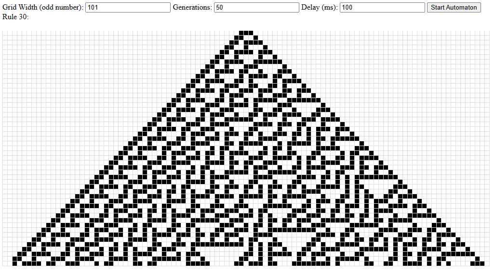

# Nested Automata

This project is a simple implementation of Wolfram's cellular automata, specifically Rule 30 and a higher rule set with 2 neighbours to the left and one to the right.

## Wolfram's Cellular Automata

Cellular automata are a type of model created by mathematician Stephen Wolfram, used for understanding how simple sets of mathematical rules can generate complex systems and patterns. Rule 30 is a specific rule set that generates a chaotic pattern, while the higher rule set in this project is a custom rule set that also generates interesting patterns.

## How to Run

To run this project, follow these steps:

1. Clone the repository to your local machine.
2. Navigate to the project directory.
3. Open the `index.html` file in your web browser.

You should now see the interface for the cellular automata. You can adjust the grid width, number of generations, and delay between generations using the input fields, and then click the "Start Automaton" button to run the automata.

Please note that the grid width should be an odd number.